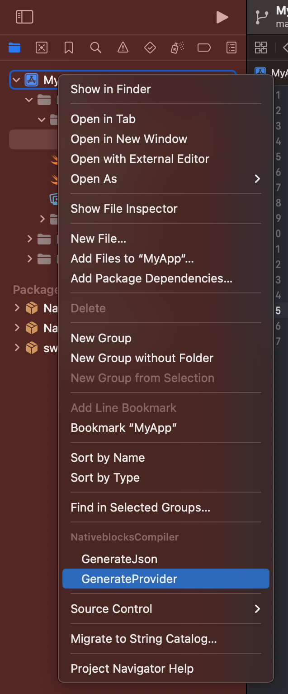
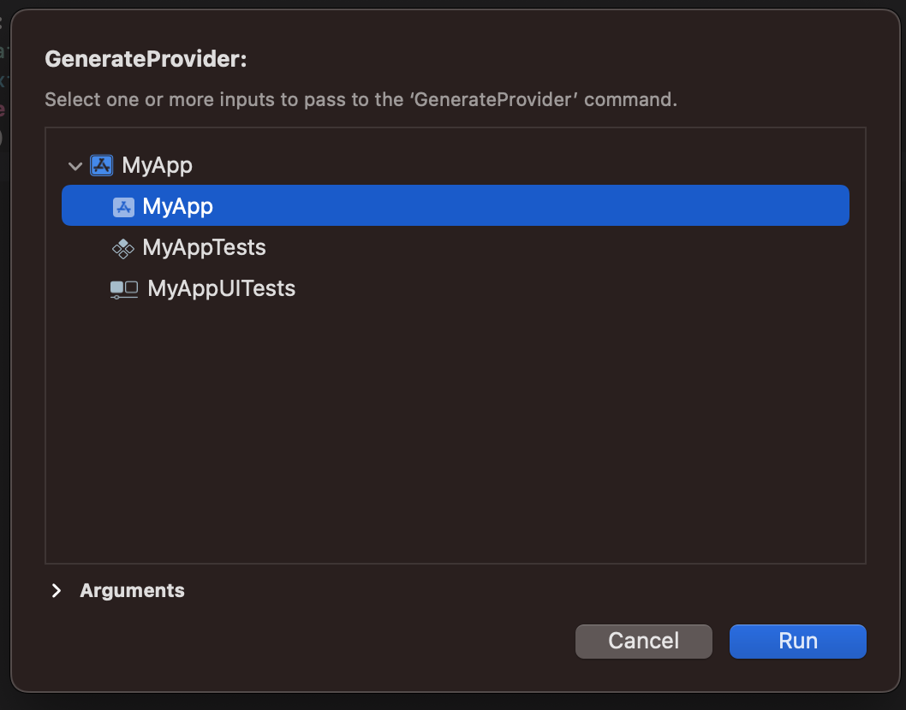
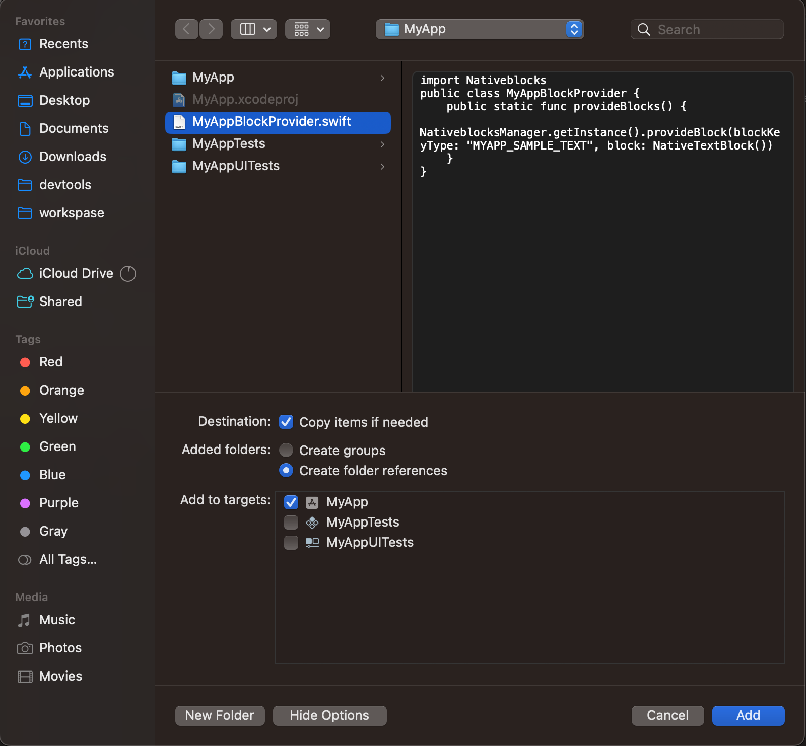
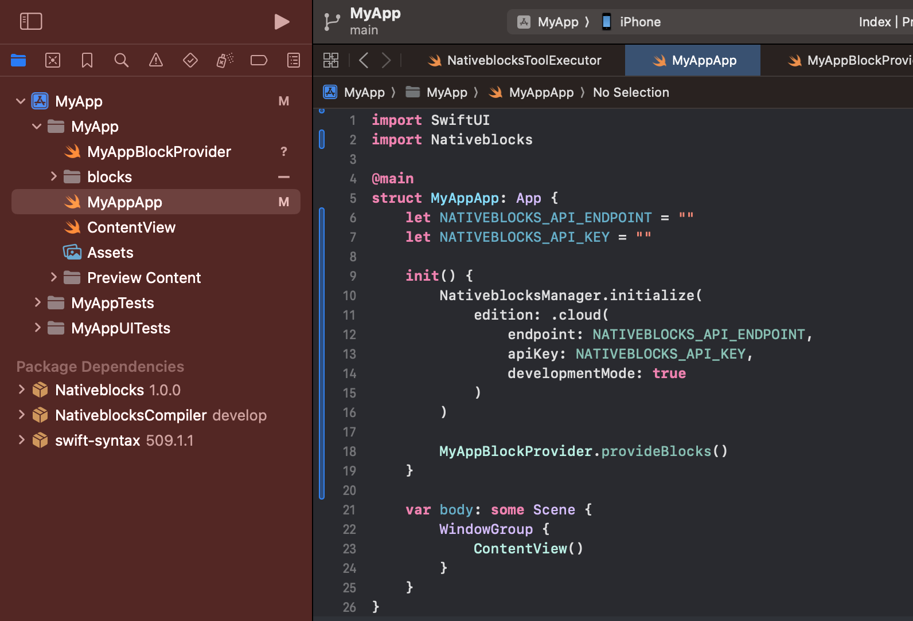

## Generate Provider

After providing annotations for blocks and actions, you can use the `GenerateProvider` plugin to generate Swift code. These can then be initialized in App or via dependency injection

Note: The prefix for the provider name comes from the target name that was selected. In this case, since we
provided "MyApp," the
the compiler generates with the "MyApp" prefix.

```swift
MyAppBlockProvider.provideBlocks()
MyAppBlockProvider.provideActions(bot)
```

1) Choose `GenerateProvider`



2) Select Target



3) Add `MyAppBlockProvider.swift` to Target



4) Use `MyAppBlockProvider`



