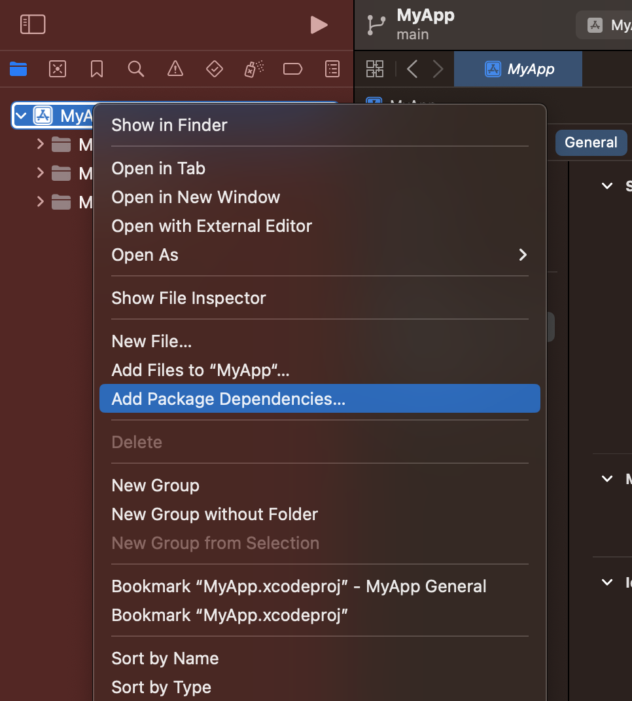
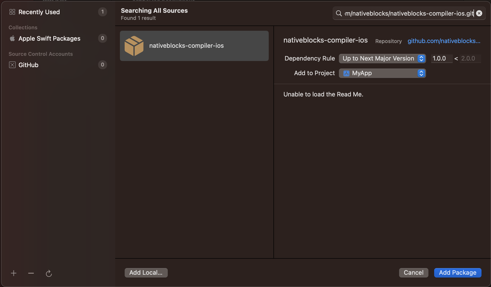
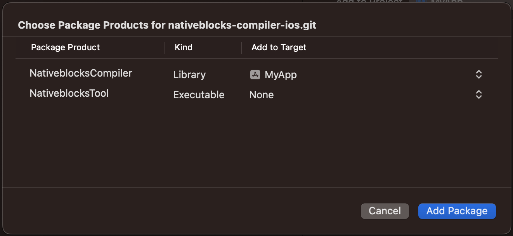

# Install the Nativeblocks Compiler frameworks

## SPM with package.swift
If your project uses its own `Package.swift` file, you can add NativeblocksCompiler as a dependency there.
1) Add NativeblocksCompiler to your dependencies list
```swift
dependencies: [
    .package(
        url: "https://github.com/nativeblocks/nativeblocks-compiler-ios.git",
        .upToNextMajor(from: "1.1.0")
    ),

],
```

2) Link the Nativeblocks product to your package target

Any targets in your application that will use NativeblocksCompiler need to have a dependency on the Nativeblocks product.

```
.target(
    name: "MyApp",
    dependencies: [
        .product(name: "NativeblocksCompiler", package: "nativeblocks-compiler-ios")
    ]

)
```

## SPM with XCode Project

If using Swift Package Manager within an Xcode project or workspace, use the Xcode project configuration UI to add the NativeblocksCompiler package.

1) Go to File > Add Packages...



2) In the dialog that appears, paste the URL of the Nativeblocks Compiler GitHub repo (https://github.com/nativeblocks/nativeblocks-compiler-ios.git) into the search bar, then select the 'nativeblocks-compiler-ios` package that appears:



3) Select which version you want to use, then click Add Package.

4) Select which packages you want to use. please select 'NativeblocksCompiler'.




