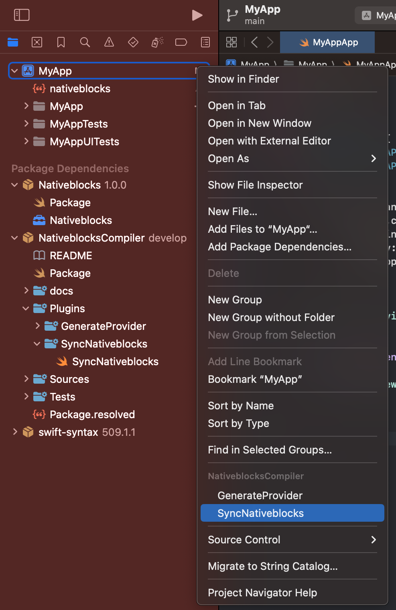

## Sync

After providing annotations for blocks and actions, you can use the `SyncNativeblocks` plugin to sync blocks and actions with nativeblocks server.

It needed to provide compiler arguments, Properties belonging to each Studio account, from Nativeblocks Studio, find Link Device and copy properties to `nativeblocks.json` file.
```json
{
    "endpoint": "",
    "authToken": "",
    "organizationId": ""
}
```

1) Choose `SyncNativeblocks`



2) Select Target


